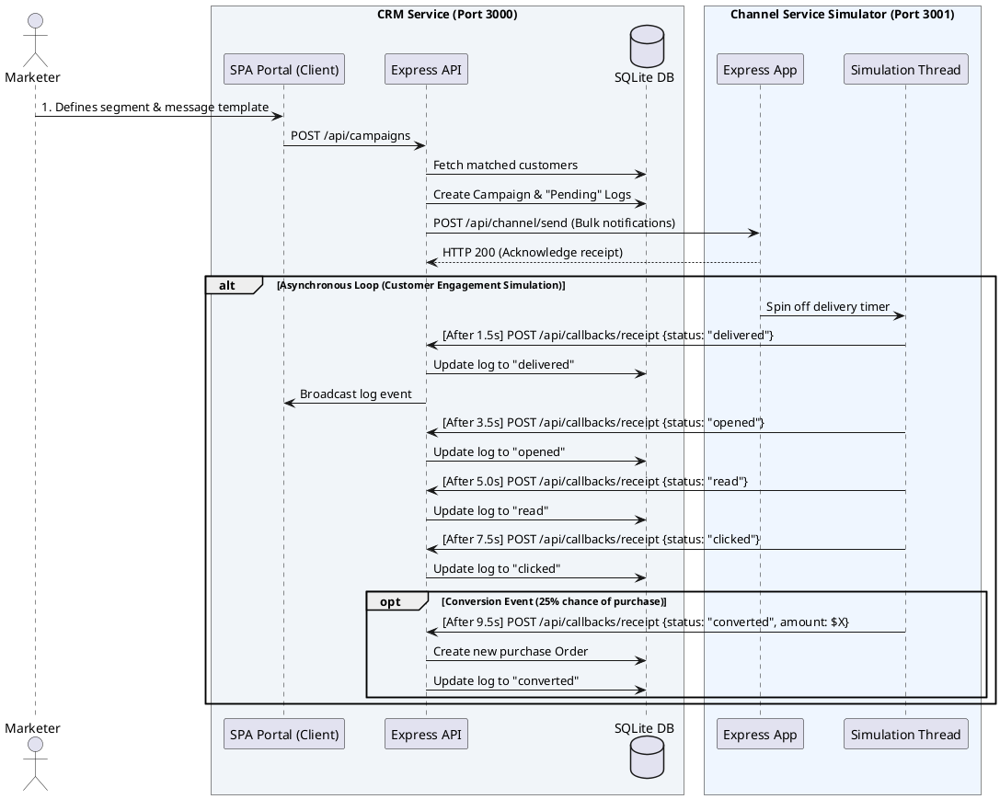

# XENO — AI-Native Mini CRM & Channel Service Simulator

XENO is a production-grade, AI-Native Mini CRM tailored for retail and Direct-to-Consumer (D2C) brands to manage shoppers, execute automated customer communication campaigns, and visualize real-time tracking metrics (delivered, opened, read, clicked, purchased) via an asynchronous webhook callback loop.

The application features a **deluxe, light-themed responsive Single Page Application (SPA)** designed with premium typography, glassmorphism, micro-animations, and a scrolling live logs console that visualizes real-time callback activity.

---

## 🏛️ System Architecture

The project splits responsibility across two decoupled HTTP servers to replicate real-world service architecture:
1. **CRM Service (Port 3000)**: Serves the client SPA dashboard, handles shopper/order ingestion, processes segmentation filters, generates campaign messages, and exposes a Webhook Web Callback Receipt endpoint.
2. **Channel Service Simulator (Port 3001)**: Stubbed dispatch engine that receives message payloads, fires an immediate delivery receipt, and schedules asynchronous callbacks using configured timers to simulate customer notification engagement.

### PlantUML Architecture Diagram

To view this diagram, copy the code below and paste it into any [PlantUML Editor](https://www.plantuml.com/plantuml):



---

## 🛠️ Technology Stack Choices & Design Rationale

### 1. Why Express.js?
* **Minimalist & High Throughput**: Express.js provides an extremely lightweight footprint, letting us spin up multiple web servers (CRM and Channel Service) concurrently inside a single container process without memory bottlenecks.
* **Easy API Composition**: Express handles raw JSON ingestion, URL parameters parsing, and CORS policies seamlessly.
* **Clean Reading & Simplicity**: Since this is an engineering assignment, Express provides an explicit route layout, making it extremely straightforward for interviewers to inspect the codebase without getting lost in framework-specific configuration directories (such as in NestJS or Next.js API structures).

### 2. Why SQLite Database?
* **Zero Configuration**: SQLite requires no external server setup, making containerization and Kubernetes deployment instantly compatible.
* **ACID Compliance**: It provides safe local storage, allowing us to perform relational joins and aggregate stats on campaigns and shopper databases out of the box.

### 3. Why Docker?
* **Absolute Portability**: Docker containerization guarantees the app behaves identically across local development machines, Kubernetes pods, and Render nodes.
* **Multi-Stage Build**: The Dockerfile separates build dependencies from production runtimes. This keeps our final image size slim, fast to deploy, and highly secure.

### 4. Why Kubernetes (`k8s.yaml`)?
* **Production-Grade Readiness**: Using Kubernetes manifests showcases how this application would scale in a cloud environment. We define separate NodePort services to make the web app accessible to traffic while isolating internal communication between pods.
* **Declarative Scale**: It enables automatic container restarts (self-healing) and defines strict CPU/Memory resource constraints.

### 5. Why Render for Deployment?
* **Developer Experience**: Render offers a Git-centric workflow that automatically builds and deploys multi-port Docker containers on commit.
* **Internal Routing Integration**: Render exposes the public CRM application, while keeping internal ports isolated to protect webhook and callback channels from outside tampering, exactly reproducing VPC designs.

---

## ⚙️ How to Setup & Run Locally

### 1. Installation
Install the development and runtime packages:
```bash
npm install
```

### 2. Run Database Seeding
Populate the SQLite database with D2C shoppers and purchase history:
```bash
npm run seed
```

### 3. Start Development Server
Spin up both the CRM Service and the Channel Simulator:
```bash
npm run dev
```
Once started:
* **CRM Dashboard & Ingestion API**: `http://localhost:3000`
* **Stubbed Channel API**: `http://localhost:3001`

---

## 🤖 AI-Native Interactions
You can activate the **AI Assistant** in the dashboard top bar:
* Ask it to: `"Create a segment for coffee lovers"`
* Ask it to: `"Find shoppers who spent more than $150"`
* Clicking **"Create Recommended Segment"** directly in the chat logs will programmatically build the rule criteria and refresh the CRM matching shoppers database instantly!
